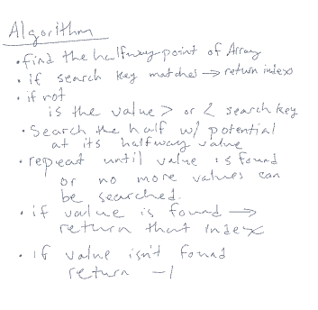
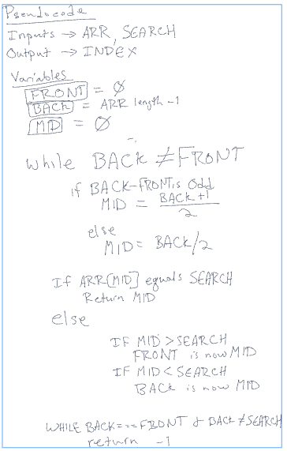
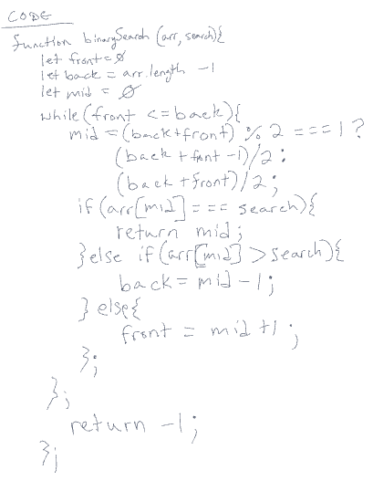
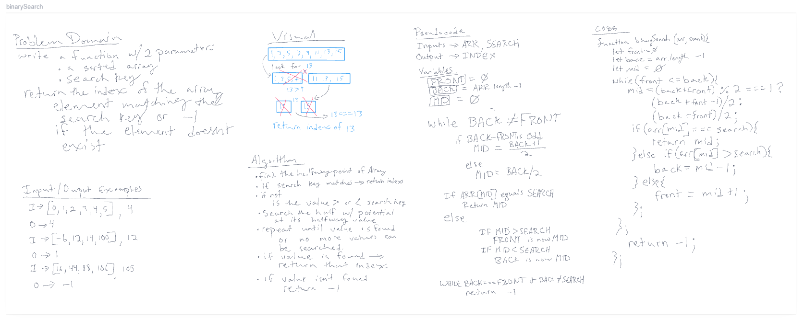

# Array Binary Search

## Problem Domain

Write a function w/ 2 parameters

* a sorted array
* search key  

return the index of the array element matching the search key or -1 if the element doesn't exist

## Input/Output Examples

|Input|Output|
|:---|:---|
|[4, 8, 15, 16, 23, 42], 15|2|
|[-131, -82, 0, 27, 42, 68, 179], 42|4|
|[11, 22, 33, 44, 55, 66, 77], 90|-1|
|[1, 2, 3, 5, 6, 7], 4|-1|

## Algorithm

## Pseudocode

## Code

## Whiteboard

