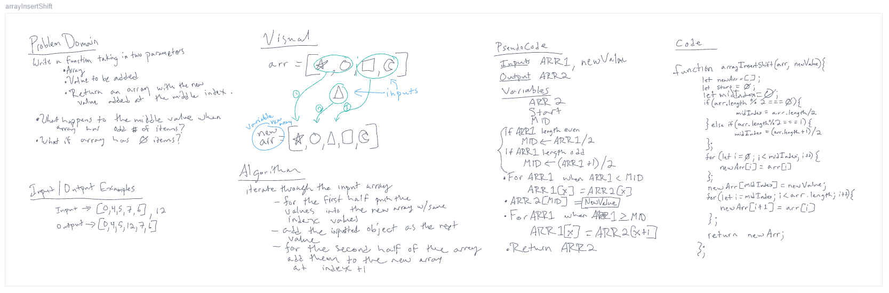

# Array Insert Shift

## Problem Domain

Write a function taking in two parameters
  -array
  -value
Return an array in which the new value is inserted into the middle index of the input array.

## Input/Output Examples

INPUT `[1,2,3,4], 6`  
OUTPUT `[1,2,6,3,4]`  

INPUT `[1,2,3], 6`  
OUTPUT `[1,2,6,3]`  

## Algorithm

iterate through the input array  
  -for the first half, push the values into the new array w/ the same index values  
  -add the input value as the middle value of the new array
  -for the second half, push the values into the new array w/ the original index+1

## Pseudocode

Inputs ARR1, NEWVALUE  
Output ARR2  

Variables

* ARR2
* START  
* MID  

if ARR1 length is even

* MID <- ARR1/2

if ARR1 length is odd

* MID <- (ARR1+1)/2

for ARR1 when ARR1 length < MID

* ARR1 = ARR2

ARR2[MID] = NEWVALUE  

for ARR1 when ARR1 >= MID  

*  ARR1[index] = ARR2[index+1]

Return ARR2

## Code

```
function arrayInsertShift(arr,newValue){
	let newArr = [];
  let start = 0;
  let midIndex = 0;
  
  if(arr.length%2 === 0){
  	midIndex = arr.length/2;
  } else if (arr.length%2 === 1){
  	midIndex = (arr.length+1)/2;
  };
  
  for (let i=0; i<midIndex; i++){
  	newArr[i] = arr[i];
  };
  newArr[midIndex] = newValue;
  for (let i=midIndex; i<arr.length;i++){
  	newArr[i+1] = arr[i];
  };
  
  console.log(midIndex);
  
  console.log(newArr);
  return(newArr);
};
```

## Whiteboard


