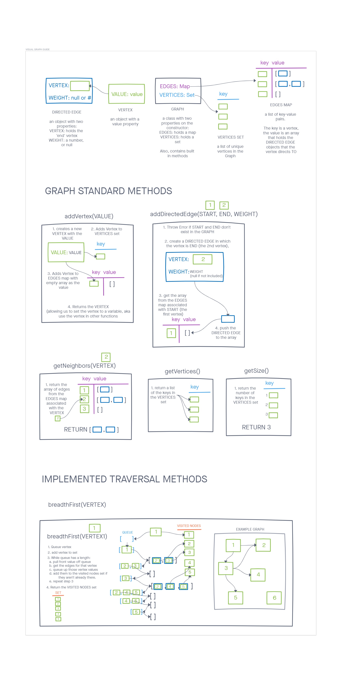

# Graph Data Structure

## Description

This graph data structure implementation is represented as an adjacency list.  

The adjacencies are kept in a javascript Map on the constructor as a `.edges` property.  Each vertex instance is also kept in a set on the constructor as the property `.vertices`.  

The class can use built-in functions to add nodes, add connections to nodes, retrieve nodes in the graph, retreive the neighbors in a node, as well as tell us the size of the graph.

Traversal is implemented using a breadth first method, and an in-order depth first method.

A function for checking the cost of a trip is also included, assuming a Graph of vertices representing cities and edges representing the cost of the connection.

>Code and Tests
>
> 1. [graph class with methods](./graph.js)
> 2. [graph class tests](./__tests__/graph.test.js)  
> 3. [businessTrip function](./businessTrip.js)  
> 4. [businessTrip function tests](./__tests__/businessTrip.test.js)  

## Visual Graph Guide

## Methods

### **addVertex(val)**

> *Add a vertex to the graph*
>
> *efficiency and approach*: Time and space are constant O(1).  One item is added to a Map, and one item is added to a Set.
>
> - Arguments: value
> - Returns: The added vertex

### **addDirectedEdge(vertex1, vertex2, weight)**

> *Adds a new edge between two vertices in the graph*  
> *If specified, assign a weight to the edge*  
> *Both vertices should already be in the Graph*
>
> *efficiency and approach*: Time and space are constant O(1).  One item is created, then data is fetched from a Map (constant) and our item is appended to that fetched data.
>
> - Arguments: 2 vertices to be connected by the edge, weight (optional)
> - Returns: nothing

### **getVertices()**

> *Returns all of the vertices in the graph as a collection (set, list, or similar)*
>
> *efficiency and approach*: Constant time and space.  This fetches a Set.
>
> - Arguments: none
> - Returns: Set of vertices

### **getNeighbors(vertex)**

> *Returns a collection of edges connected to the given vertex*  
> *Include the weight of the connection in the returned collection*
>
> *efficiency and approach*: Constant time and space.  This fetches the value from one item in a Map.
>
> - Arguments: vertex
> - Returns: collection of edges

### **getSize()**

> *Returns the total number of vertices in the graph*
>
> *efficiency and approach*: Constant time and space.  This grabs the size value on a set.
>
> - Arguments: none
> - Returns: number

### **breadthFirst(vertex)**

> *Display the collection of nodes*
>
> Time and space are O(n) because of the implementation of a queue.  At worst, every vertex is visited and added to the queue, then dequeued and added to a set.
>
> - Arguments: vertex
> - Returns: A collection of nodes in the order they were visited.

### **depthFirst(vertex)**

> *Returns a set of the vertices in-order*
>
> Time and space are O(n) because we recurse through every possible node.  At worst, every vertex is visited and added to the queue, then dequeued and added to a set.
>
> - Arguments: vertex
> - Returns: A collection of nodes in the order they were visited.

### **businessTrip(graph, cities)**

> *Returns a sum of all the weights of the edges if each city in the cities array connects*
>
> *Returns true if vertices (cities) connect in the order of the array, returns false if vertices (cities) don't connect.
>
> - Arguments: a graph and an array of vertices in the graph
> - Returns: an object with two properties:  
> { connects: *true or false*,  
>  cost: *a price in dollars* }  

## Tests

### Tests for the graph test assert the following

1. vertex can be successfully added to the graph
2. An edge can be successfully added to the graph
3. A collection of all vertices can be properly retrieved from the graph
4. All appropriate neighbors can be retrieved from the graph
5. Neighbors are returned with the weight between vertices included
6. The proper size is returned, representing the number of vertices in the graph
7. A graph with only one vertex and edge can be properly returned
8. An error is thrown if an edge is created with vertices that don't exist
9. If all vertices are connected, breadthFirst will return the full set of vertices in the map with no repeats
10. If no vertices are connected to the vertex argument, breadthFirst will return a set with just the one vertex
11. Only the connected vertices will be returned in the breadthFirst set
12. A set of nodes is returned from depthFirst
13. If a node is listed as a neighbor to many different nodes, the node will only be added once to the set.
14. The nodes are returned in the order they were visited.

### Tests for the businessTrip function assert the following

1. when a trip is valid, the function returns true with a cost for the trip.
2. when a trip doesn't connect, the function returns false with a message for unconnected trips
3. when a city isn't in the graph, an error will be thrown
