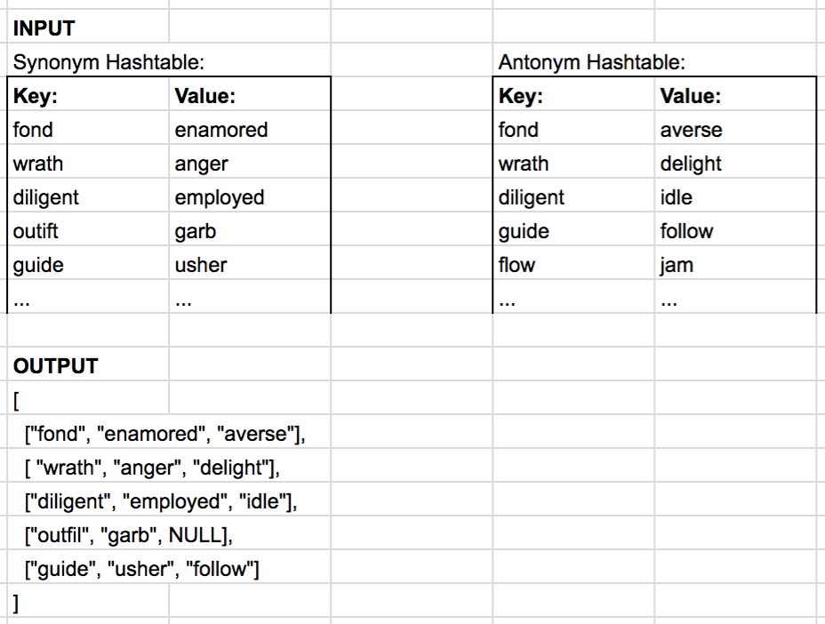

# Repeated Word

## Problem Domain

Write a function that uses the concept of [left join](https://www.tutorialspoint.com/sql/sql-left-joins.htm) to join two hashmaps.  
The function takes in two arguments, the first being the left map, and the second being the map that is being joined.  
The output of the function is an array of objects with key, synonym, and antonym as properties.  
key and synonym will always be filled, but the antonym field may be null if there is nothing to fill from the second hashmap.

example input and output:
 

## Whiteboard


## Tests

- returns an array of objects with the key, antonym and synonym
- should not add items from the 2nd hash map if the first hashmap does not have that same key  
- should create items in the array, even if there are no matching keys in the 2nd hashmap
- should return an empty array if there are no items in the first hashmap  

[leftJoinHashmap tests](./__tests__/hashmap-left-join.test.js)

## Working Function

```leftJoinHashmap
function leftJoinHashmap(hashmap1, hashmap2){
  let leftJoinArray = [];
  hashmap1.keys.forEach(key => {
    let antonym = hashmap2.get(key);
    leftJoinArray.push({
      key: key,
      keySynonym: hashmap1.get(key),
      keyAntonym: antonym,
    });
  });
  return leftJoinArray;
};
```

[leftJoinHashmap function](./function/leftJoinHashmap.js)  