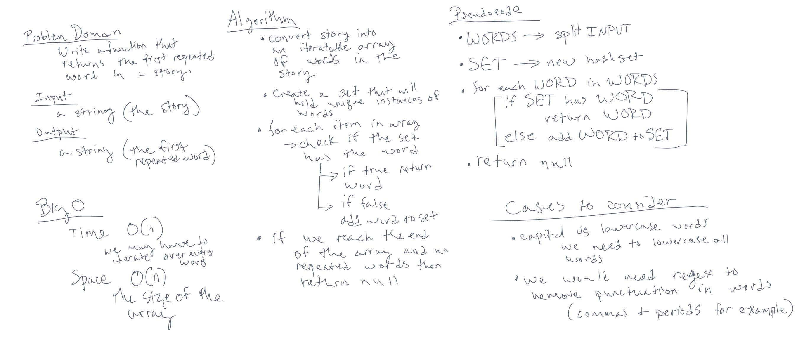

# Repeated Word

## Problem Domain

Find the first repeated word in a book using a function called repeatedWord.  
The function takes in one argument, the story, in the form of a string.  
The output of the function is the first word in the story that is repeated, also a string.

> Sample Input -> `"Once upon a time, there was a brave princess who..."`  
> Sample Output -> `"a"`  

## Whiteboard



## Tests

- returns the first completed word  
- returns word even if one is capitalized and one is lowercase  
- returns the word even if there is punctuation before or after the word  
- returns null if no words are repeated  

[repeatedWord tests](./__tests__/repeatedWord.test.js)


## Working Function

```repeatedWord
function repeatedWord(story){

  const regex = /[!"#$%&'()*+,-./:;<=>?@[\]^_`{|}~]/g;
  const regexStory = removePunctuation(story, regex);

  const words = regexStory.split(' ');

  let wordSet = new Set();

  for (let i=0; i<words.length; i++){
    if (wordSet.has(words[i].toLowerCase())){
      return words[i].toLowerCase();
    }else{
      wordSet.add(words[i].toLowerCase());
    }
  }

  return null;

};

function removePunctuation(string, regex){
  return string.replace(regex, '');
}
```

[repeatedWord function](./function/repeatedWord.js)