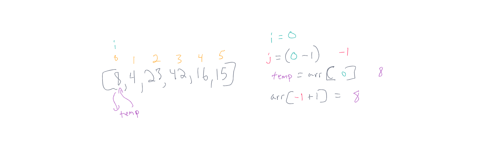
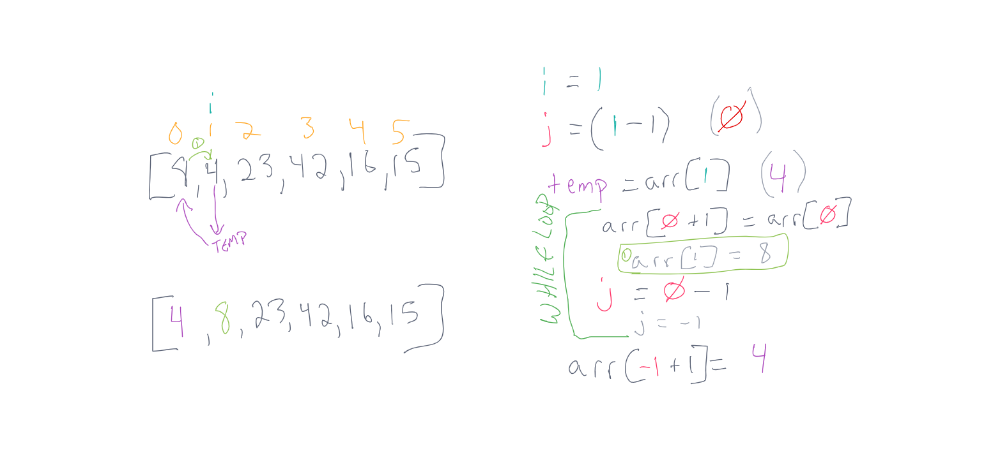
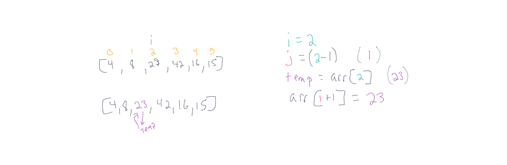
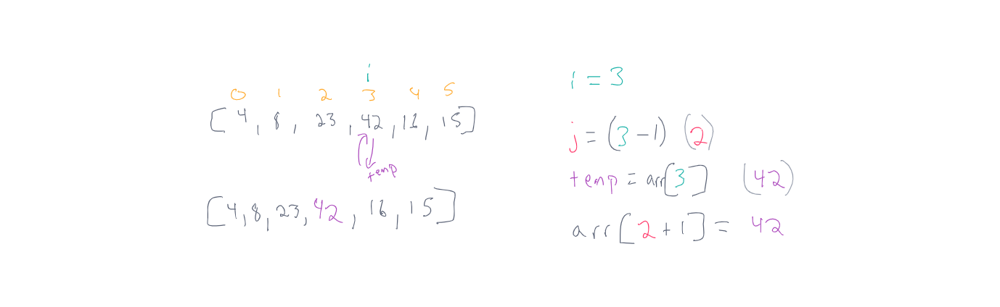
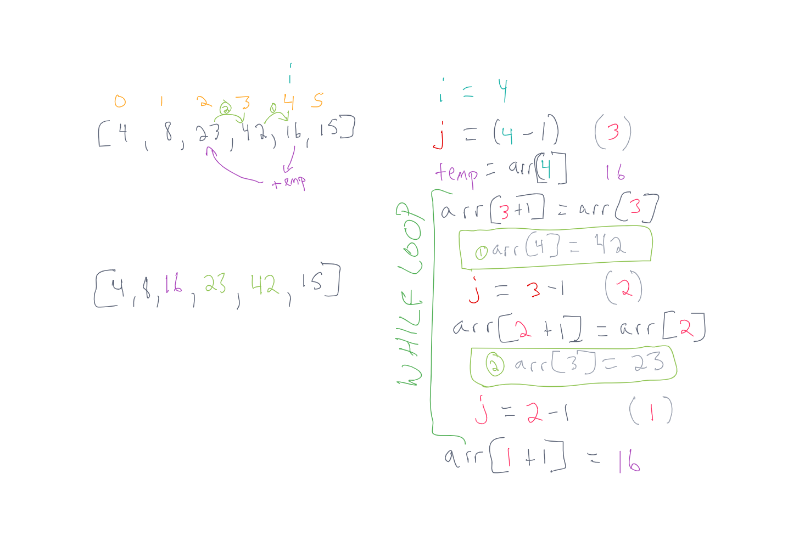
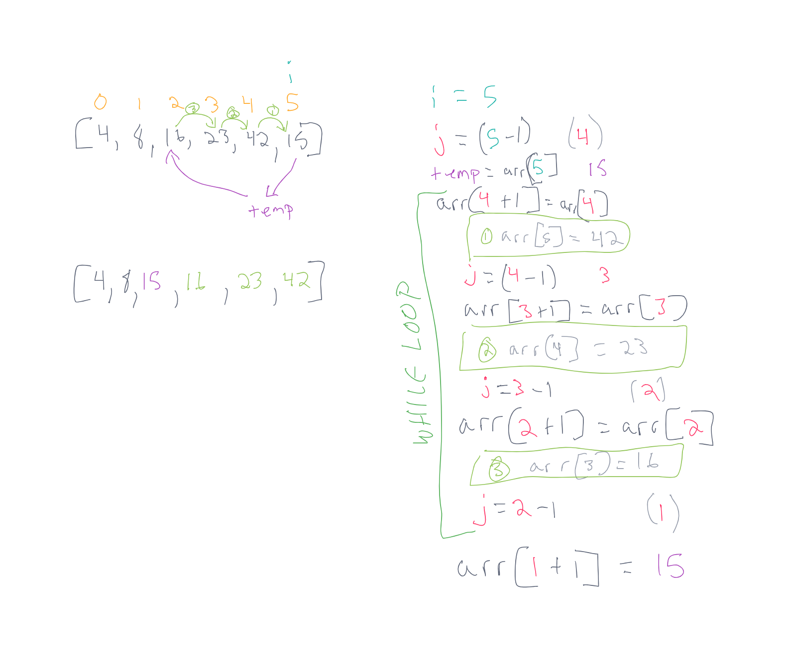

# **Insertion Sort**

Insertion sort is a function that takes in an array of integers as an argument.  the function iterates over each item in the array, and checks if the items before it are higher than its value.  while the item we are checking is lower, we will continue to bump the higher values forward, and put the value in the correct position.  The fuction returns the array with the values sorted.

## **Pseudocode**

``` pseudocode
  InsertionSort(int[] arr)
    FOR i = 1 to arr.length
      int j <-- i - 1
      int temp <-- arr[i]
      WHILE j >= 0 AND temp < arr[j]
        arr[j + 1] <-- arr[j]
        j <-- j - 1
      arr[j + 1] <-- temp
```

## **insertion sort**

sample array `[8, 4, 23, 42, 16, 15]`

### *Pass 1*

  
In the first pass of insertion sort, we reference the index 0 with varible `i`, and store the value of that index, which is 8, into a `temp` variable.  We skip the while loop, because `j` (one less than our `i` value) is less than 0.  We then put our `temp` value of 8 into the array position of 0 (1+ our `j` value).  8 is currently the smallest value and stays at the front position.

### *Pass 2*

  
In the second pass of insertion sort, we reference the index 1 with variable `i`, and store the value of `i`, which is 4 into a `temp` variable.  Then, in our while loop, we determine 8 is greater than 4, so we assign the value of index 1 to the same value of index 0, which is 8.  we move our `j` pointer to the position before 8, and we put the temp value of 4 in its place. Our outcome is moving 8 forward, and moving 4 back - a swap.

### *Pass 3*

  
In the third pass of insertion sort, we reference the index 2 with variable `i`, and store the value of `i`, which is 23 into a `temp` variable.  Then, we determine the value before index i is not greater than 23 so we skip the while loop.  Then, we put the temp value back in the position of `j`+1 which is `i`.  We haven't changed anything in the sorting.

### *Pass 4*

  
The fourth pass follows the same format of pass 3, except it is referencing the next index `i` which is 42.  42 is not less than the value before it `j`, so no shift has to happen.

### *Pass 5*

  
In pass 5, we reference index value 4 and save that to variable `i`.  We reference the position before it with `j` being `i`-1.  Our `temp` variable hold the value of the array at index `i`, which is 16.  We go into the while loop because 16 is not greater than 42, so we put the value of 42 into the `j`+1 position.  Then we decrement j and see that `temp` (16) is also not greater than the value in the `j` position which is 23 and then we decrement `j`.  We shift 23 into the `j` + 1 position, and check again, this time breaking out of the while loop, because `temp` is indeed greater than the `j` positions value, and assign temp to the `j` + 1 position.  We have shifted two values forward, and put `temp` value into the previous position of the last shifted value.

### *Pass 6*

  
In pass 6, we continue by referencing the `i` value 5.  we store the value of the array at position `i` into our `temp` variable.  `temp` is holding 15, so we will keep checking the values before position `i` using `j` as a pointer, and if the value of position `j` is greater than our `temp` value we push the value forward, and decrement our `j` reference.  We do this three times, until we can break out of our while loop because `temp` is greater than array at position `j`.  we then put the temp value into position `j` + 1.  This is three shifts, up, and moving our temp value from index 5 to index 2.

## **Code**

```javascript
function insertionSort(arr){
  for (let i=0; i<arr.length; i++){
    let j = i-1;
    let temp = arr[i];
    while(j >= 0 && temp < arr[j]){
      arr[j+1] = arr[j];
      j=j-1;
    }
    arr[j+1] = temp
  }
  return arr;
}
```

[insertionSort JS](./insertionSort.js)

## **Tests**

Tests written to prove the function performs the following tasks:

- sorts an array of numbers, returning the sorted array
- will sort an array with only one value
- array can contain negative values
- array can contain 0
- will return an empty array if the input array has no values

[insertionSort tests](../__tests__/insertionSort.test.js)
