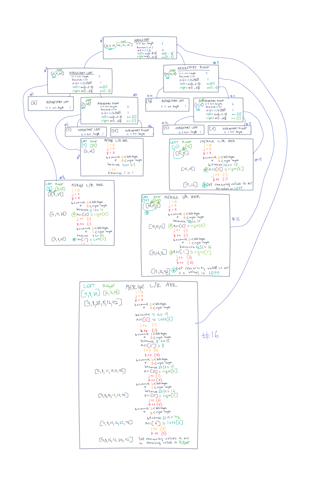

# **Merge Sort**

Merge sort is a function that takes in an array of integers as an argument.  It then recursively sorts each half of the array, swapping values where necessary.  When each half has been sorted, the two halves will merge with a helper function that uses three variables `i` representing the index of the left half, `j` representing the index of the right half and `k` representing the index of the desired array.  Comparisons between values will put values into the correct position in the returned array.

## **Pseudocode**

``` pseudocode
  InsertionSort(int[] arr)
    FOR i = 1 to arr.length
      int j <-- i - 1
      int temp <-- arr[i]
      WHILE j >= 0 AND temp < arr[j]
        arr[j + 1] <-- arr[j]
        j <-- j - 1
      arr[j + 1] <-- temp
```

## **merge sort**

sample array `[8, 4, 23, 42, 16, 15}`  
*see **STEPS MAP** below for a visual of these steps*

### *Step 1*

mergeSort takes in the array and assigns variables to the `left` and `right` halves of the array, using the array length and mid point as references.  Using recursion, we will now run merge sort on the left half of the array and the right half of the array.

### *Step 2*

We take the left half and divide it into a `left` and a `right`, and we have logic that will always round down the mid value, meaning if we have an odd number of integers in our array, the mid value will go to the right side.

### *Step 3*

When we run merge sort on the left side again, we only have one value, which breaks us out of the function, and the left side is left as the array with a singular value.

### *Step 4*

Running merge sort on the right side, we assign one value to `left` and one value to `right`.

### *Step 5/6*

In both merge sort iterations on the left and right, our arrays only have one value, so we exit the function.

### *Step 7*

We will now run the merge on the `left` `[4]` and `right` `[23]` variables, also taking in the original array, `[4, 23]`.  The merge function then checks if the left value at index `i` is larger than the right value at index `j`.  Because the left value is smaller, we push that into the array at index `k`.  We increment our `k` value regardless of which side gets pushed in, but only increment the `i` or `j` value depending on if the left or right value get added to the array.  Once the `i` or `j` value reaches its corresponding array length, we will push the rest of the values from the other array into the remaining positions of the array.  In this case, [4, 23] is already sorted, so nothing really changes.

### *Step 8*

This step follows the same logic as step 7, except it is now comparing the `left` side `[8]` and the `right` side `[4, 23]`.  We always start by comparing the first values of the two sides, so in this case 8 and 4.  because 4 is less than 8 and it is on the right side, we add 4 to the array, increment `j` (our position on the right side), and always increment `k` to move to the next position in our final array.  We continue comparing values and incrementing the index references whenever we set something from the left or right side.  First, replacing the first index with 4, then remplacing the second index with 8.  We exit the function with the result `[4, 8, 23]`.

### *Step 9*

With the left side completely resolved on our original array, we will now move on to the right side sorting following much of the same process.  This time our `left` value is a singular `[42]` and our `right` value is `[16,15]`.

### *Step 10*

Again, our left value array contains only a singular integer, so no additional sorting is needed and `left` can stay assigned `[8]`.

### *Step 11*

On the right side we break up the `left` and `right` into their parts `[16]` and `[15]` respectively.

### *Step 12/13*

Both left and right are singular integers in an array, so no sorting happens and those variables don't change.

### *Step 14*

The merge happens on the `right` side array value of `[16, 15]` also taking in the `left` and `right` values from our previous merge sort.  The first index of our array gets replaced by the smaller right value, and the left value is inserted into the remaining positions.  we end up with a swapped and sorted right side `[15, 16]`.

### *Step 15*

Now we need to merge the `left` side `[42]` and the right side `[15, 16]`.  15 is lower than 42, so 15 is put into the first position and `j` increments.  Then 16 is compared to 42 and 16 is put into the next position of the array and `j` increments again.  Finally, because `j` is not less than the array length of the right side, all values from the left side get added, which is only 42.  We end with the three values sorted `[15, 16, 42]`

### *Step 16*

The final step is merging the sorted right and left sides of our original array.  The `left` side being `[4, 8, 23]` and the `right` side being `[15, 16, 42]`.  4 is compared against 15 and 4 is added, then 8 is compared to 15 and 8 is added, then 23 is compared to 15 and 15 is added, then 23 is compared to 16 and 16 is added, then 23 is compared to 42 and 23 is added.  Finally, the `i` variable is not smaller than the `left` array length, so everything remaining in the right side is added.  We end up with our fully sorted array `[4, 8, 15, 16, 23, 42]`.

### **STEPS MAP**



## **Code**

```javascript
function mergeSort(arr){
  let n = arr.length;
  if(n>1){
    let mid = Math.floor(n/2);
    let left = arr.slice(0, mid);
    let right = arr.slice(mid);

    mergeSort(left);
    mergeSort(right);

    doMerge(left, right, arr);
  }
  return arr;
}

function doMerge(left, right, arr){
  let i = 0, j=0, k=0;
  while(i<left.length && j<right.length){
    if(left[i] <= right[j]){
      arr[k]=left[i];
      i++;
    }else{
      arr[k]=right[j];
      j++;
    }
    k++;
  }
  if(i===left.length){
    while(k<arr.length){
      arr[k]=right[j];
      j++;
      k++;
    }
  }else{
    while(k<arr.length){
      arr[k]=left[i];
      i++;
      k++;
    }
  }
}
```

[mergeSort JS](./mergeSort.js)

## **Tests**

Tests written to prove the function performs the following tasks:

- sorts array of already sorted values
- sort an array of reversed values
- sorts an array of even length
- sorts an array of odd length
- sorts array with one value
- returns empty array when input array is empty
- sorts 0 and negative values

[insertionSort tests](../__tests__/mergeSort.test.js)
