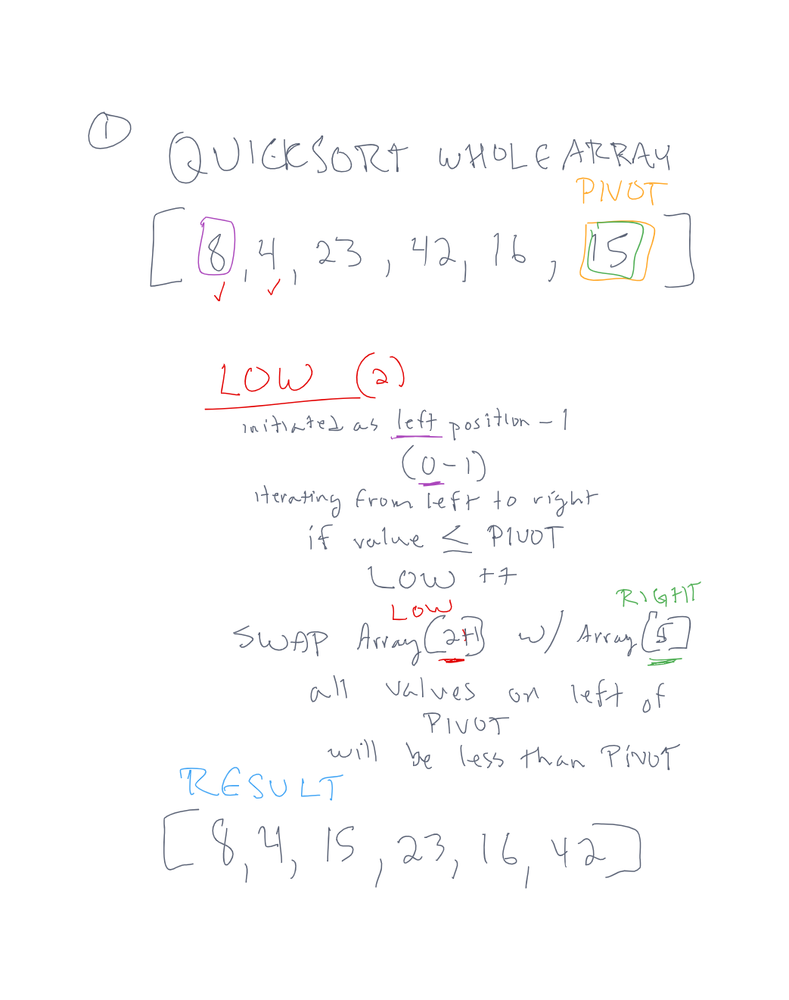
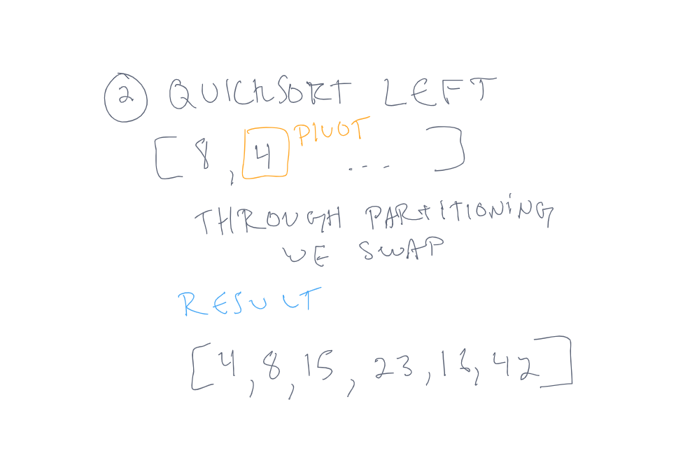
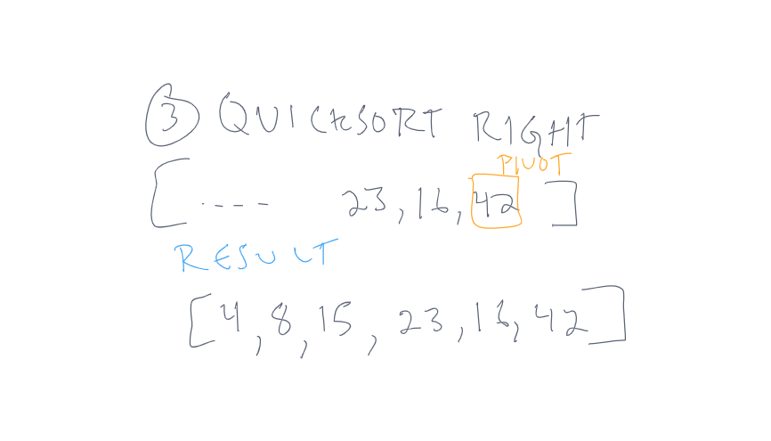
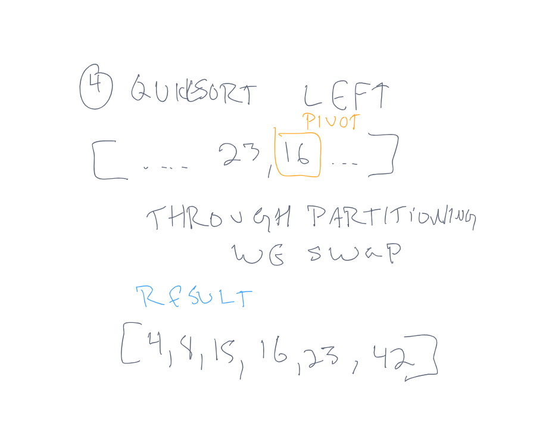

# **Merge Sort**

Merge sort is a function that takes in an array of integers as an argument.  It then recursively sorts the array by comparing the values to a pivot point - in this case, using the last value in the array.  When the values are lower than the pivot value, a reference will increase in count and sort the array by pushing all the values that are higher ahead of it.  The values higher than the pivot will be to the right, and the values lower will be to the left.  The left and right continue to be sorted recursively, until the whole array is sorted.

## **Pseudocode**

``` pseudocode
ALGORITHM QuickSort(arr, left, right)
    if left < right
        DEFINE position <-- Partition(arr, left, right)
        QuickSort(arr, left, position - 1)
        QuickSort(arr, position + 1, right)

ALGORITHM Partition(arr, left, right)
    DEFINE pivot <-- arr[right]
    DEFINE low <-- left - 1
    for i <- left to right do
        if arr[i] <= pivot
            low++
            Swap(arr, i, low)

     return low

ALGORITHM Swap(arr, i, low)
    DEFINE temp;
    temp <-- arr[i]
    arr[i] <-- arr[low]
    arr[low] <-- temp
```

## **merge sort**

sample array `[8, 4, 23, 42, 16, 15}`  

### *Step 1*



First, we set front and end to the indicies of 8 and 15 (0 and 5).  Then we set pivot to the value at the end position.

As we iterate through the array, we increase a count `low` if the value at the index is lower, and does a swap, which pushes all of the higher values to the right and the lower values to the left.

When we finish the array, we have the pivot point in the correct position, and the left half is everything lower than the pivot value, and the right half is everything higher than the pivot value.

### *Step 2*



Recursively, we run quicksort on the left half, reassigning pivot to the position to the left of the previous pivot value.  

The partition function then swaps them by pushing the higher 8 value to the right.

### *Step 3*



We follow the same process to the right of the original pivot point.  This time, our left value is one more than the pivot value.

Nothing changes as we iterate through the array, because 23, and 16 are lower than 42.

### *Step 4*



Finally, we do our last recursive function, assigning the pivot value to 16, and doing a swap similar to step 2.  We end up with a fully sorted array.

## **Code**

```javascript
function quickSort(arr){
  let left = 0;
  let right = arr.length-1;
  doQuickSort(arr, left, right);
  return arr;
};

function doQuickSort(arr, left, right){
  if (left<right){
    let position = partition(arr, left, right);
    doQuickSort(arr, left, position-1);
    doQuickSort(arr, position+1, right);
  }
  return arr;
}

function partition(arr, left, right){
  let pivot = arr[right];
  let low = left - 1;

  for (let i=left; i<=right; i++){
    if(arr[i]<=pivot){
      low ++;
      swap(arr, i, low);
    }
  }

  return low;
}

function swap(arr, i, low){
  let temp = arr[i];
  arr[i] = arr[low];
  arr[low] = temp;
}
```

[quickSort JS](./quickSort.js)

## **Tests**

Tests written to prove the function performs the following tasks:

- sorts array of already sorted values
- sort an array of reversed values
- sorts an array of even length
- sorts an array of odd length
- sorts array with one value
- returns empty array when input array is empty
- sorts 0 and negative values

[quickSort tests](../__tests__/quickSort.test.js)
