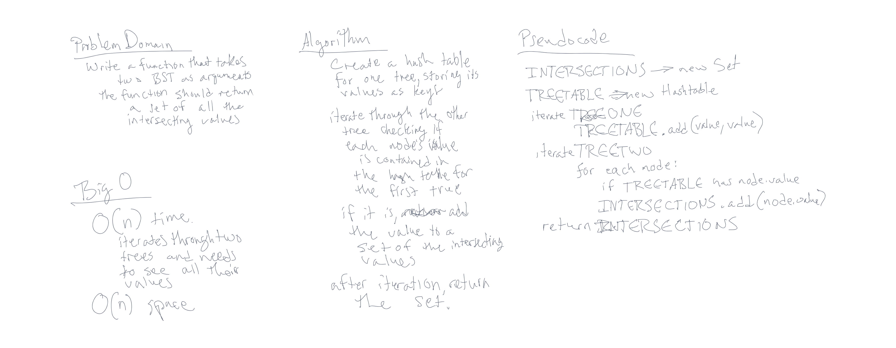

# Tree Intersection

## Problem Domain

Find common values in 2 binary trees.  
The function takes in two arguments, both being binary search trees.  
The output of the function is a set of all the intersecting values between the two trees.

## Whiteboard



## Tests

- returns a set of the intersecting values  
- same result returns if tree one and tree two are swapped as arguments
- if either tree is empty an empty set will be returned.

[treeIntersection tests](./__tests__/tree-intersection.test.js)


## Working Function

```treeIntersection
function treeIntersection(tree1, tree2){
  let intersections = [];
  let treeOneTable = new HashTable(50);

  addToTable(tree1.root, treeOneTable);
  checkIntersections(tree2.root, treeOneTable, intersections);

  return intersections;
};

function addToTable(node, treeTable){
  if (node){
    treeTable.add(node.value.toString(), node.value);
    addToTable(node.left, treeTable);
    addToTable(node.right, treeTable);
  }
  return;
}

function checkIntersections(node, treeTable, set){
  if (node){
    if (treeTable.get(node.value.toString())){
      set.push(node.value);
    }
    checkIntersections(node.left, treeTable, set);
    checkIntersections(node.right, treeTable, set);
  }
  return;
}
```

[treeIntersection function](./function/tree-intersection.js)